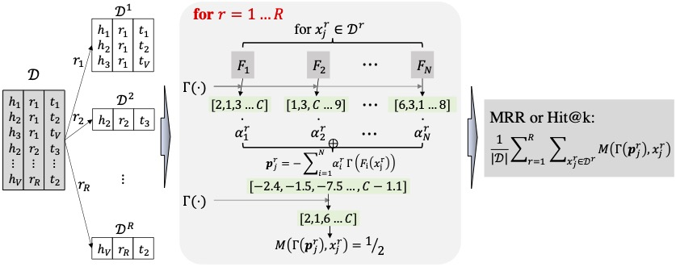
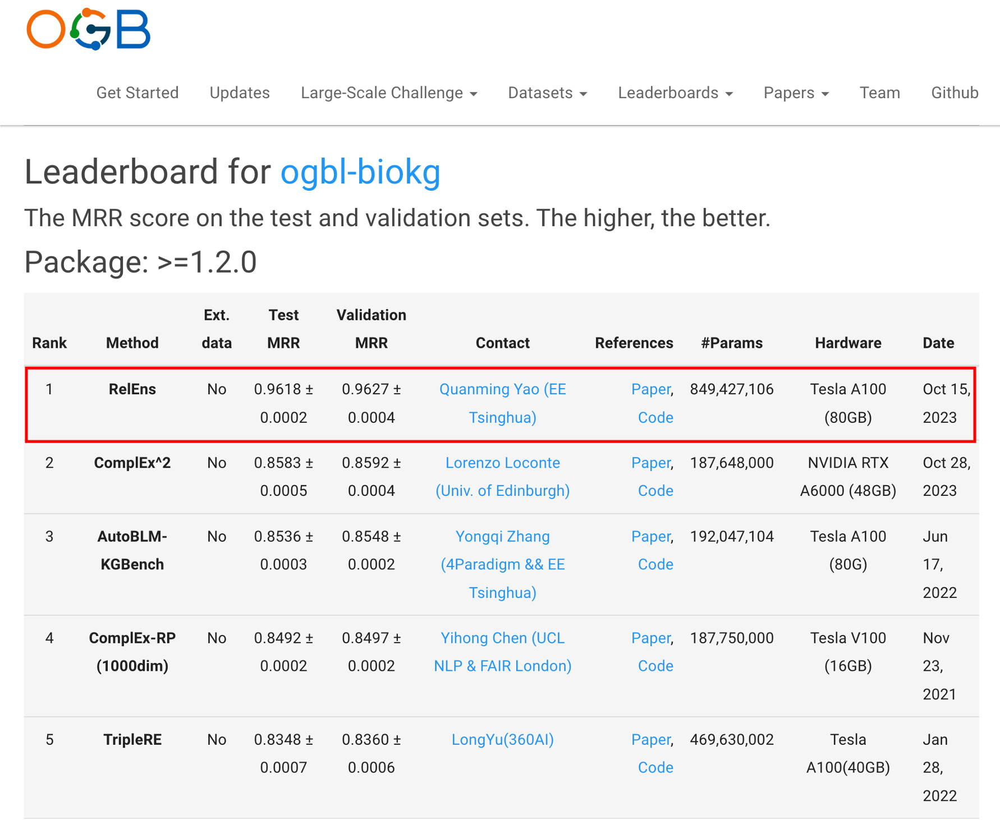
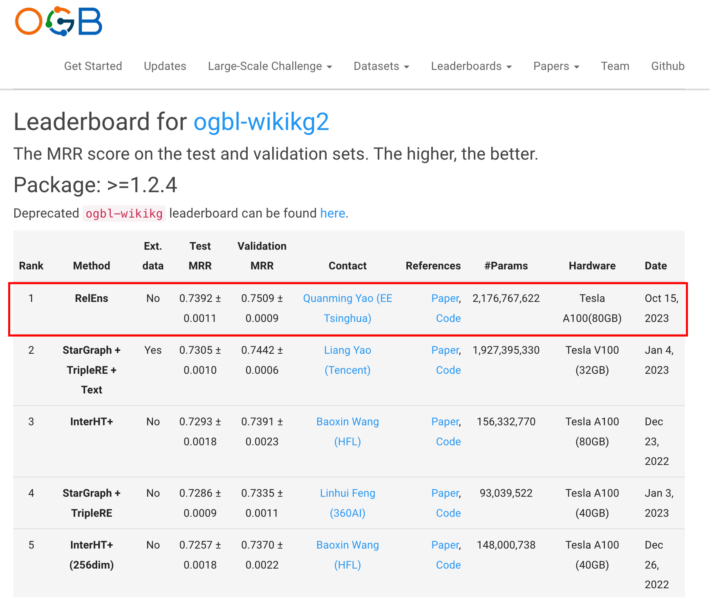

# RelEns


<p align="center"></p>
<p align="center"><b>Overview of the RelEns.</b></p>

Code for the paper [**Relation-aware Ensemble Learning for Knowledge Graph Embedding**](http://arxiv.org/abs/2310.08917). Accepted by EMNLP 2023.
This paper proposes a relation-aware ensemble method with divide-concur method and achieving state-of-the-art KG embedding performance.
## Quick Start 
Here, we provide a quick start guide on how to reproduce the results.

### Download dataset
For the OGB dataset, you don't need to do anything. We will download it automatically.
For WN18RR, FB15k-237 and NELL-995, you can download them from [here](https://github.com/LARS-research/KGTuner/tree/master/code/dataset)

### Download the project and install the required dependencies.
```bash
git clone https://github.com/LARS-research/RelEns.git
cd RelEns
pip install -r requirements.txt
```

### Prepare predictions of the base models.
You need to prepare the predictions for the base model.

The directory structure is as follows:
```
|-- ranks
    |-- {dataset1_name}
        |-- {model1_name}_valid_ranks.npy
        |-- {model1_name}_test_ranks.npy
    |-- {dataset2_name}
        |-- {model2_name}_valid_ranks.npy
        |-- {model2_name}_test_ranks.npy
```

For WN18RR, FB15k-237, and NELL-995, the shape of the ranks npy file is (#number of samples, #number of entities) and contains the entity ranks for every sample. The rank belongs to the range [1, #number of entities].

For OGB datasets, the shape of the ranks npy file is (#number of samples, 1002). It includes 1002 columns, which consist of 1 positive head rank, 500 head negative ranks, 1 positive tail rank, and 500 tail negative ranks.

### Run the code
To run the code, you can execute the ogb_main.ipynb file for OGB datasets and main.ipynb for other datasets. Additionally, the log for ogbl-biokg and WN18RR are already available.

## Leaderboard
<p align="center"></p>
<p align="center"></p>

## Citation
Please kindly cite this paper if you use the code.
```
@article{yue2023relation,
  title={Relation-aware Ensemble Learning for Knowledge Graph Embedding},
  author={Yue, Ling and Zhang, Yongqi and Yao, Quanming and Li, Yong and Wu, Xian and Zhang, Ziheng and Lin, Zhenxi and Zheng, Yefeng},
  year={2023},
  eprint={2303.08917},
  archivePrefix={arXiv},
  primaryClass={cs.LG}
}
```

## License
RelEns is released under the MIT license. Further details can be found [here](LICENSE).
